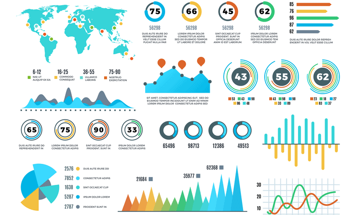

#  Interactive Data Visualization with Plotly

## Overview

In a world where data is often referred to as the "oil of the future," the need to process and understand vast amounts of data is increasingly important. Raw data, much like crude oil, requires refining to extract valuable insights. This is where data visualization libraries come to the rescue, especially for those working with programming languages. These libraries transform raw data into easily interpretable visual formats, effectively giving data a voice to communicate the insights it holds.

One such library, **Plotly**, has brought a fresh approach to data visualization in the modern data science landscape. Plotly is an interactive visualization library that works seamlessly with popular programming languages like Python, R, and JavaScript, allowing users to dynamically present their data analyses and results.



### Why Choose Plotly?

Plotly's applications are vast and diverse. From financial analysis to bioinformatics, from educational materials to business presentations, Plotly is used across various fields. Its interactive features allow users to explore graphs, zoom in on specific data points, and even retrieve more information about those points. This interaction makes the presentation of findings from datasets more engaging and effective for the audience.

#### Key Features of Plotly:

- **Interactivity**: Unlike libraries such as Matplotlib or Seaborn, which produce excellent but static visuals, Plotly enables dynamic interaction with the graphics, offering a more engaging experience.
- **Web Integration**: Plotly can be easily integrated into web-based projects, making it a crucial tool in modern data science applications.
- **Versatility**: It is not limited to Python and works across different languages and platforms, enhancing its usability.

### Installation

To get started with Plotly and related tools, you'll need to install a few libraries. Run the following commands to install them:

```bash
pip install plotly
pip install dash            # For building reactive web applications (dashboards)
pip install wordcloud       # Useful in NLP for visualizing word importance
pip install cufflinks       # Integrates Plotly with Pandas
pip install missingno       # For visualizing missing data
```

### Taking Your Visualizations to the Next Level

In an increasingly digital world, static visualizations may not be enough to capture the attention of your audience. The growing expectation for interactive content can be effectively met with Plotly, making your data presentations more compelling and informative.

With Plotly, you can elevate your data visualizations, making your analyses more impactful. Let’s dive into an example and prepare a beautiful notebook together!

---

Thank you for exploring this project. If you have any questions or feedback, feel free to open an issue or contact me directly.
